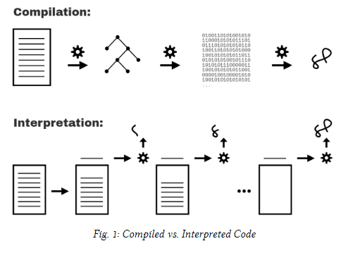

# You don´t know JavaScript Yet - Scope & Closures


## Chapter 1: What’s theScope?

### Compiled vs. Interpreted
Everyone on the Software Engenering or programming have hear about code complilation at least once, but perhaps is seeems like a misterious black box and not knowing what happen inside it, at the end complilation is a set of processes to translate the instruction coded on the orgram to a set of instructions that the computer can undestand

We can identify two types of this processes translation, on one hand we have the **Compilation** and on the other hand we have the **Interpretation**, 

Typically, the code complilation is transformed all at once while the interpretated code is tranformed line by lines as in in *Figure 1*



However currently nothing is just black or White, modern JS engines employ numerous variation of both compilation and interpretation in the handling of JS programs.

### Compiling Code

Why does it matter whether JS is compuiled or not?

In classic compiler theory, a program is processed by a compiler in three basic stages:

- **Tokenizing/Lexing**:
    Breaking up a string of charactersinto meaningful (to the language) chunks, called tokens.
    For instance, consider the program:var a = 2;. Thisprogram would likely be broken up into the followingtokens:var,a,=,2, and;. Whitespace may or maynot be persisted as a token, depending on whether it’smeaningful or not
- **Parsing**:
    taking a stream (array) of tokens and turningit into a tree of nested elements, which collectivelyrepresent the grammatical structure of the program. Thisis called an Abstract Syntax Tree (AST).For example, the tree forvar a = 2;might start witha top-level node calledVariableDeclaration, with achild node calledIdentifier(whose value isa), andanother child calledAssignmentExpressionwhich it-self has a child calledNumericLiteral(whose value is2).
- **Code Generation**:
    aking an AST and turning it into ex-ecutable code. This part varies greatly depending on thelanguage, the platform it’s targeting, and other factors.The JS engine takes the just described AST forvar a= 2;and turns it into a set of machine instructions toactuallycreatea variable calleda(including reservingmemory, etc.), and then store a value intoa.

The JS engine is vastly more complex thanjustthese three stages. In the process of parsing and code generation, thereare steps to optimize the performance of the execution (i.e.,collapsing redundant elements). In fact, code can even be re-compiled and re-optimized during the progression of execu-tion

### Required: Two Phases
To state it as simply as possible, the most important observa-tion we can make about processing of JS programs is that itoccurs in (at least) two phases: parsing/compilation first, thenexecution.

The separation of a parsing/compilation phase from the sub-sequent execution phase is observable fact, not theory or opin-ion. While the JS specification does not require “compilation”explicitly, it requires behavior that is essentially only practicalwith a compile-then-execute approach.

There are three program characteristics you can observe toprove this to yourself: syntax errors, early errors, and hoisting.


### Compiler Speak

With awareness of the two-phase processing of a JS program(compile, then execute), let’s turn our attention to how theJS engine identifies variables and determines the scopes of aprogram as it is compiled.

First, let’s examine a simple JS program to use for analysisover the next several chapters:
```
var students=[
    { id:14, name:"Kyle"},
    { id:73, name:"Suzy"},
    { id:112, name:"Frank"},
    { id:6, name:"Sarah"}
    ];
function getStudentName(studentID) {
    for(letstudentofstudents) {
        if(student.id==studentID) {
            returnstudent.name;
            }
        }
    }
var nextStudent = getStudentName(73);
console.log(nextStudent);
// Suz
```

There are to types of roles, the *targets* and the *sources*, and how do we identify if a variable is a target?, just by checking if there is a value that is being assigned to it; if so, it´s a targetm if not then the variables is a source.

### Targets

As we mentioned before, what makes a variable a target is the assignment of a value as we can see on the previous code  the *var students = [ ..* is handled entirely as a declaration and so, a target.

### Sources

Otherwise what makes a variable a soruce is the reference of an value assigned variable, let´s considere in the previous code *for (let student od students)* in which *student* is being assigned with one or meny values from *students*, so it is a target, But, *students* itserf is a soruce.

### Cheating: Runtime ScopeModifications

### Lexical Scope


## Chapter 2: IllustratingLexical Scope

### Marbles, and Buckets, andBubbles... Oh My!

### A Conversation Among Friends

### Nested Scope

### Lookup Failures
#### Undefined Mess
#### Global... What!?

### Building On Metaphors

### Continue the Conversation


## Chapter 3: The ScopeChain