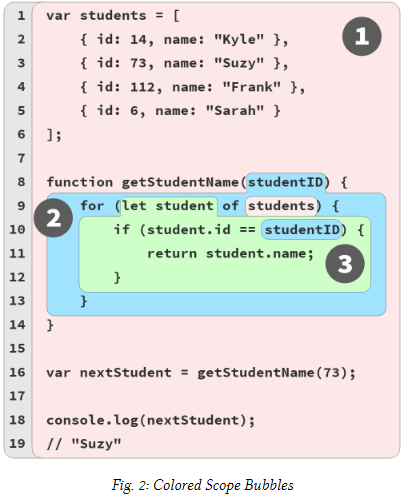

# You don´t know JavaScript Yet - Scope & Closures


## Chapter 1: What’s theScope?

### Compiled vs. Interpreted
Everyone on the Software Engenering or programming have hear about code complilation at least once, but perhaps is seeems like a misterious black box and not knowing what happen inside it, at the end complilation is a set of processes to translate the instruction coded on the orgram to a set of instructions that the computer can undestand

We can identify two types of this processes translation, on one hand we have the **Compilation** and on the other hand we have the **Interpretation**, 

Typically, the code complilation is transformed all at once while the interpretated code is tranformed line by lines as in in *Figure 1*


However currently nothing is just black or White, modern JS engines employ numerous variation of both compilation and interpretation in the handling of JS programs.

### Compiling Code

Why does it matter whether JS is compuiled or not?

In classic compiler theory, a program is processed by a compiler in three basic stages:

- **Tokenizing/Lexing**:
    Breaking up a string of charactersinto meaningful (to the language) chunks, called tokens.
    For instance, consider the program:var a = 2;. Thisprogram would likely be broken up into the followingtokens:var,a,=,2, and;. Whitespace may or maynot be persisted as a token, depending on whether it’smeaningful or not
- **Parsing**:
    taking a stream (array) of tokens and turningit into a tree of nested elements, which collectivelyrepresent the grammatical structure of the program. Thisis called an Abstract Syntax Tree (AST).For example, the tree forvar a = 2;might start witha top-level node calledVariableDeclaration, with achild node calledIdentifier(whose value isa), andanother child calledAssignmentExpressionwhich it-self has a child calledNumericLiteral(whose value is2).
- **Code Generation**:
    aking an AST and turning it into ex-ecutable code. This part varies greatly depending on thelanguage, the platform it’s targeting, and other factors.The JS engine takes the just described AST forvar a= 2;and turns it into a set of machine instructions toactuallycreatea variable calleda(including reservingmemory, etc.), and then store a value intoa.

The JS engine is vastly more complex thanjustthese three stages. In the process of parsing and code generation, thereare steps to optimize the performance of the execution (i.e.,collapsing redundant elements). In fact, code can even be re-compiled and re-optimized during the progression of execu-tion

### Required: Two Phases
To state it as simply as possible, the most important observa-tion we can make about processing of JS programs is that itoccurs in (at least) two phases: parsing/compilation first, thenexecution.

The separation of a parsing/compilation phase from the sub-sequent execution phase is observable fact, not theory or opin-ion. While the JS specification does not require “compilation”explicitly, it requires behavior that is essentially only practicalwith a compile-then-execute approach.

There are three program characteristics you can observe toprove this to yourself: syntax errors, early errors, and hoisting.


### Compiler Speak

With awareness of the two-phase processing of a JS program(compile, then execute), let’s turn our attention to how theJS engine identifies variables and determines the scopes of aprogram as it is compiled.

First, let’s examine a simple JS program to use for analysisover the next several chapters:
```
var students=[
    { id:14, name:"Kyle"},
    { id:73, name:"Suzy"},
    { id:112, name:"Frank"},
    { id:6, name:"Sarah"}
    ];
function getStudentName(studentID) {
    for(letstudentofstudents) {
        if(student.id==studentID) {
            returnstudent.name;
            }
        }
    }
var nextStudent = getStudentName(73);
console.log(nextStudent);
// Suz
```

There are to types of roles, the *targets* and the *sources*, and how do we identify if a variable is a target?, just by checking if there is a value that is being assigned to it; if so, it´s a targetm if not then the variables is a source.

### Targets

As we mentioned before, what makes a variable a target is the assignment of a value as we can see on the previous code  the *var students = [ ..* is handled entirely as a declaration and so, a target.

### Sources

Otherwise what makes a variable a soruce is the reference of an value assigned variable, let´s considere in the previous code *for (let student od students)* in which *student* is being assigned with one or meny values from *students*, so it is a target, But, *students* itserf is a soruce.

### Cheating: Runtime ScopeModifications
All the scope is defined on the program compilation and should not be affected by runtime conditions. However there are technically still two ways to cheat and modify the program scope.

It´s importan to mention that neither of this cheats should be used because both are so dangerous and confusing.

The **eval(..)** function gets a string code to compile and execute on the fly during the program runtime

```
function badIdea() {
    eval("var oops = 'Ugh!';");
    console.log(oops);
}
badIdea();
// Ugh!
```

The second cheat is the **with** keyword that essentially dynamically turns an object into a local scope-its properties are trated as identifiers in the new scope´s block

```
va badIde = { oops: "Ugh!"};

with (badIdea) {
    console.log(oops); 
}
// Ugh!
```

### Lexical Scope
We’ve demonstrated that JS’s scope is determined at compiletime; the term for this kind of scope is “lexical scope”.

the keyidea of “lexical scope” is that it’s controlled entirely by the placement of functions, blocks, and variable declarations, inrelation to one another.

If you place a variable declaration inside a function, thecompiler handles this declaration as it’s parsing the function,and associates that declaration with the function’s scope. Ifa variable is block-scope declared (let/const), then it’sassociated with the nearest enclosing{ .. }block, ratherthan its enclosing function (as withvar).

## Chapter 2: IllustratingLexical Scope

This chapter will illustratescopewith several metaphors. Thegoal here is tothinkabout how your program is handled bythe JS engine in ways that more closely align with how the JSengine actually works.

### Marbles, and Buckets, andBubbles... Oh My!
Imagine you come across a pile of marbles, and notice that allthe marbles are colored red, blue, or green. Let’s sort all themarbles, dropping the red ones into a red bucket, green into agreen bucket, and blue into a blue bucket. After sorting, whenyou later need a green marble, you already know the greenbucket is where to go to get it.

```
// outer/global scope: REDvarstudents=[
    { id:14, name:"Kyle"},
    { id:73, name:"Suzy"},
    { id:112, name:"Frank"},
    { id:6, name:"Sarah"}
    ];
function getStudentName (studentID) {
    // function scope: BLUE
    for(letstudentofstudents) {
        // loop scope: GREEN
        if(student.id==studentID) {
            returnstudent.name;
        }
    }
}
var nextStudent = getStudentName(73);
console.log(nextStudent);
// Suzy
```
Figure 2 helps visualize the boundaries of the scopes bydrawing colored bubbles (aka, buckets) around each




1. Bubble 1(RED) encompasses the global scope, whichholds three identifiers/variables:students(line 1),get-StudentName(line 8), andnextStudent(line 16).
2. Bubble 2(BLUE) encompasses the scope of the functiongetStudentName(..)(line 8), which holds just oneidentifier/variable: the parameterstudentID(line 8).
3. Bubble 3(GREEN) encompasses the scope of thefor-loop (line 9), which holds just one identifier/variable:student(line 9).

An expression in the RED(1) bucket only has access to RED(1)marbles,notBLUE(2) or GREEN(3). An expression in theBLUE(2) bucket can reference either BLUE(2) or RED(1) mar-bles,notGREEN(3). And an expression in the GREEN(3)bucket has access to RED(1), BLUE(2), and GREEN(3) marbles.


### Uninitialized Variables (aka, TDZ)
```
var studentName = "Kyle";
{
    console.log(studentName); 
    // ???
    // ..
    let studentName = "Suzy";
    console.log(studentName);
    // Suzy
}
```

What’s going to happen with the firstconsole.log(..)statement? Iflet studentNamedidn’t hoist to the top of thescope, then the first *console.log(..)* shouldprint "Kyle", right? At that moment, it would seem, only the outerstu-dentNameexists, so that’s the variable console.log(..) should access and print.

But instead, the firstconsole.log(..)throws a TDZ error,because in fact, the inner scope’s *studentNamewas* hoisted(auto-registered at the top of the scope). What **didn’t** happen(yet!) was the auto-initialization of that innerstudentName;it’s still uninitialized at that moment, hence the TDZ viola-tion!

So to summarize, TDZ errors occur because *let/const* declarations **do** hoist their declarations to the top of their scopes,but unlike *var*, they defer the auto-initialization of their variables until the moment in the code’s sequencing wherethe original declaration appeared. This window of time (hint:temporal), whatever its length, is the TDZ.